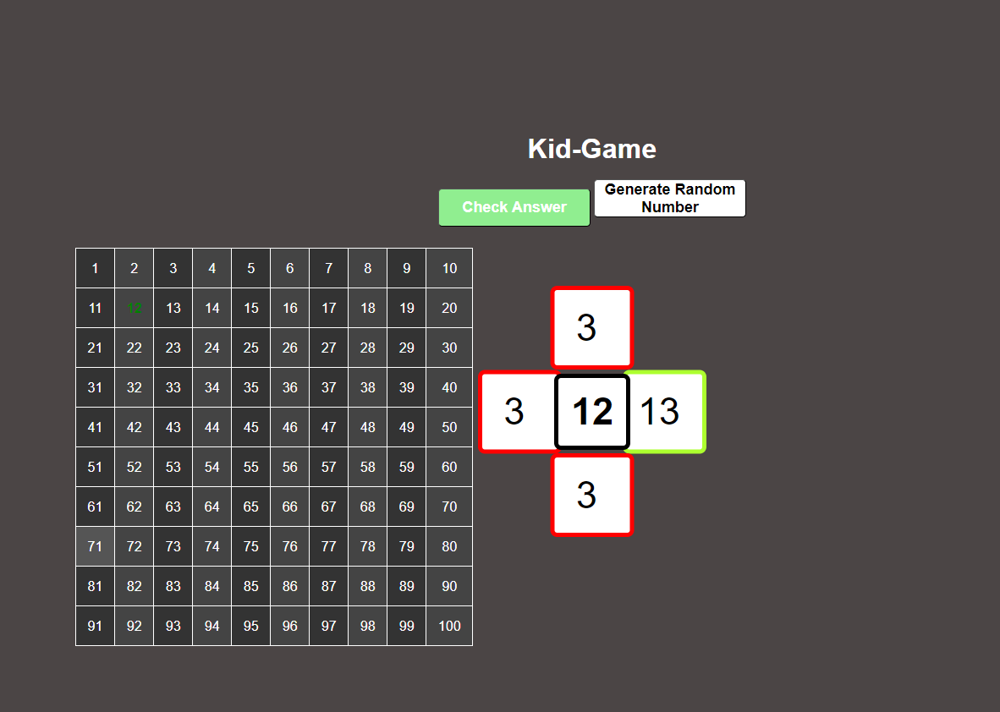

# 🎲 Number Guessing Game

- This project is a simple number guessing game built with HTML, CSS, and JavaScript. Users are challenged to guess numbers based on a randomly generated number displayed in a grid. The game includes input validation and visual feedback to enhance the user experience




# 🚀 Features
- 🎯 Generates a random number between 1 and 100.
- 🎲 Displays a 10x10 grid of numbers.
- ✍️ Users have four input fields to guess numbers based on simple arithmetic (addition and subtraction).
- ⚡ Provides immediate feedback on user inputs (correct or incorrect).
- 🔄 Allows users to generate a new random number and reset the game.

---

# 💻  Technologies Used
- HTML: Structure of the web page.
- CSS: Styling for the game elements.
- JavaScript: Game logic and interactivity.

---

# 📜 Code Explanation
- 🏗️ HTML Structure
    - The HTML file contains a div to hold the number grid, buttons for user interaction, and input fields for user guesses. The table for displaying numbers and the feedback elements for user inputs are created dynamically using JavaScript.

- 🧠 JavaScript Logic

---

## 1. Global Variables:
 -  let randomNumber;: Holds the random number generated for the game.
```javascript
  let randomNumber;
 ```
- Purpose: This variable will store the random number generated for the guessing game.

   

---

# 🎲 Functions
- 🎲 ```generateRandomNumber()```
##  2. Generating a Random Number
 ```javascript
function generateRandomNumber() {
    randomNumber = Math.floor(Math.random() * 100) + 1; // Generates a random number between 1 and 100
    document.getElementById('randomNumber').textContent = randomNumber; // Displays the generated number
    createNumberTable(randomNumber); // Creates and displays the number grid
    Reset_GameBoxes_And_More(); // Resets input fields and feedback
    DisableBTN(); // Disables the "Check Answers" button until inputs are filled
}
   ```
- Purpose: This function generates a new random number, displays it on the screen, creates a number grid, resets any previous game state, and ensures the "Check Answers" button is disabled until the user fills in their guesses.
  
    - 🎲 Generates a new random number between 1 and 100.
    - 🔄 Calls createNumberTable(randomNumber) to update the displayed grid.
    - 🧹 Calls Reset_GameBoxes_And_More() to clear previous inputs and feedback.
    - ⛔ Disables the "Check Answers" button until the user has filled out the input fields.

---

## 3. Resetting Game Boxes and Feedback
```javascript
function Reset_GameBoxes_And_More() {
    for (let i = 1; i <= 4; i++) {
        document.getElementById(`InputUser_TXT${i}`).value = ""; // Clears each input field
        document.getElementById(`TxtBox${i}_CorrectAnswer`).textContent = ""; // Clears displayed correct answers
        const parentBox = document.querySelectorAll('.input-box')[i - 1];
        parentBox.classList.remove('correct', 'wrong'); // Removes visual feedback classes
    }
} 
`
- Purpose: This function clears all input fields and feedback messages, ensuring a clean state for the next round of guesses.


```

---

## 4.  Enabling and Disabling the Check Answers Button
```javascript
function Reset_GameBoxes_And_More() {
    for (let i = 1; i <= 4; i++) {
        document.getElementById(`InputUser_TXT${i}`).value = ""; // Clears each input field
        document.getElementById(`TxtBox${i}_CorrectAnswer`).textContent = ""; // Clears displayed correct answers
        const parentBox = document.querySelectorAll('.input-box')[i - 1];
        parentBox.classList.remove('correct', 'wrong'); // Removes visual feedback classes
    }
}
```
- Purpose: This function clears all input fields and feedback messages, ensuring a clean state for the next round of guesses.

-  🧼 ```Reset_GameBoxes_And_More()```:
   -  🧼 Clears the values of the input fields and any displayed correct answers.
   -  🧹 Removes any visual feedback (correct or wrong) from previous guesses to ensure a fresh start.

---

##  5. Enabling and Disabling the Check Answers Button
 ```javascript 
function EnableBTN() {
    const button = document.getElementById('checkanswer');
    button.disabled = false; // Enables the button
    button.classList.remove('disable');
    button.classList.add('enable'); // Changes button appearance
}

function DisableBTN() {
    const button = document.getElementById('checkanswer');
    button.disabled = true; // Disables the button
    button.classList.add('disable');
    button.classList.remove('enable'); // Changes button appearance
}
```
- Purpose: These functions control the state of the "Check Answers" button, enabling or disabling it based on user input.

---

##  6. Checking if All Input Boxes are Filled
 ```javascript 
function AllBoxesFilled() {
    const allFilled = [...Array(4).keys()].every(i => document.getElementById(`InputUser_TXT${i + 1}`).value.trim() !== "");
    allFilled ? EnableBTN() : DisableBTN(); // Enables the button if all inputs are filled, otherwise disables it
}

```

- Purpose: This function checks whether all input fields have been filled. If they are, it enables the button; if not, it keeps it disabled.

  -   ✅ Checks if all four input fields are filled.
  -   🎛️ Updates the state of the "Check Answers" button accordingly, enabling it only when all fields have values.


 ```javascript 
function EnableBTN() {
    const button = document.getElementById('checkanswer');
    button.disabled = false; // Enables the button
    button.classList.remove('disable');
    button.classList.add('enable'); // Changes button appearance
}

function DisableBTN() {
    const button = document.getElementById('checkanswer');
    button.disabled = true; // Disables the button
    button.classList.add('disable');
    button.classList.remove('enable'); // Changes button appearance
}
```
- Purpose: These functions control the state of the "Check Answers" button, enabling or disabling it based on user input.

- 🔓 ```EnableBTN() and DisableBTN()```:
   - 🔓 EnableBTN(): Enables the "Check Answers" button, allowing users to submit their guesses.
   - 🔒 DisableBTN(): Disables the button, preventing submission until all input fields are filled.
 
---

 

##  7. Checking User Answers
 ```javascript
document.getElementById("checkanswer").addEventListener("click", function() {
    const correctAnswers = [
        randomNumber + 10,
        randomNumber + 1,
        randomNumber - 10,
        randomNumber - 1
    ]; // Array of correct answers based on the random number

    correctAnswers.forEach((answer, index) => {
        const input = document.getElementById(`InputUser_TXT${index + 1}`).value.trim(); // User's input
        const parentBox = document.querySelectorAll('.input-box')[index];

        if (parseInt(input) === answer) {
            parentBox.classList.add('correct'); // Adds correct class if the answer matches
            parentBox.classList.remove('wrong');
            document.getElementById(`TxtBox${index + 1}_CorrectAnswer`).textContent = answer; // Displays correct answer
        } else {
            parentBox.classList.add('wrong'); // Adds wrong class if the answer does not match
            parentBox.classList.remove('correct');
        }
    });
});
```
-  Purpose: This event listener checks user inputs against the correct answers when the button is clicked. It provides feedback on whether each guess was correct or wrong and updates the display accordingly.


- ✔️ ```checkAnswers()```:
  - ✔️ Compares the user's inputs against the correct answers derived from the random number.
  - 🎉 Provides visual feedback (green for correct, red for incorrect) by adding or removing classes based on the user's input.

---

##  8. Creating the Number Table
 ```javascript
function createNumberTable(randomNumber) {
    const tableContainer = document.getElementById('table-container');
    tableContainer.innerHTML = ''; // Clears the previous table
    const table = document.createElement('table'); // Creates a new table
    let counter = 1;

    for (let i = 0; i < 10; i++) { // Creates 10 rows
        const tr = document.createElement('tr');
        for (let j = 0; j < 10; j++) { // Creates 10 columns
            const td = document.createElement('td');
            td.textContent = counter; // Sets the cell's number
            if (counter === randomNumber) {
                td.classList.add('highlight'); // Highlights the cell with the random number
            }
            tr.appendChild(td);
            counter++;
        }
        table.appendChild(tr);
    }

    tableContainer.appendChild(table); // Appends the table to the container
}

```
- Purpose: This function creates a 10x10 grid of numbers and highlights the cell containing the random number. It updates the display every time a new number is generated.

---

## 9. Initializing the Game
 ```javascript
generateRandomNumber(); // Starts the game by generating a random number
setInterval(AllBoxesFilled, 0); // Continuously checks if all input boxes are filled
```
- Purpose: This code initializes the game when the page loads, generating the first random number and setting up an interval to monitor the input fields.


- 📊 ```createNumberTable(randomNumber)```
 ```javascript
function createNumberTable(randomNumber) {
    const tableContainer = document.getElementById('table-container');
    tableContainer.innerHTML = ''; // Clears the previous table
    const table = document.createElement('table'); // Creates a new table
    let counter = 1;

    for (let i = 0; i < 10; i++) { // Creates 10 rows
        const tr = document.createElement('tr');
        for (let j = 0; j < 10; j++) { // Creates 10 columns
            const td = document.createElement('td');
            td.textContent = counter; // Sets the cell's number
            if (counter === randomNumber) {
                td.classList.add('highlight'); // Highlights the cell with the random number
            }
            tr.appendChild(td);
            counter++;
        }
        table.appendChild(tr);
    }

    tableContainer.appendChild(table); // Appends the table to the container
}
```

   - 📊 Creates a 10x10 table displaying numbers from 1 to 100.
   - 🟩 Highlights the cell that contains the randomly generated number, making it easy for users to see their target.
 
  ---

## CSS Code Explanation

## 1. Resetting Default Styles

```css

* {
    margin: 0;
    padding: 0;
    box-sizing: border-box;
}

```
- Purpose: Resets margin and padding for all elements to create a consistent look across browsers and sets the box model to include padding and border in the element's total width and height.

---

## Body Styling

```css
body {
    display: flex;
    flex-direction: column;
    align-items: center;
    justify-content: center;
    min-height: 100vh;
    background-color: #4b4545; // Dark background
    color: white; // White text
    font-family: Arial, sans-serif; // Font family
}

```
- Purpose: Centers content vertically and horizontally, sets a dark background color, and applies a white font color for contrast.


## Heading Styling
```css
h1 {
    margin-bottom: 10px;
    font-size: 36px;
    color: #fff;
    height: 50px;
}
```

- Purpose: Styles the main heading, adjusting the size and color for visibility.

---

## Table Styling

```css
.table-container TABLE table {
    width: 50%;
    border-collapse: collapse; // Merges borders
}

td {
    border: 2px solid #fff; // White border for cells
    padding: 15px; // Cell padding
    text-align: center; // Center text
    background-color: #333; // Dark cell background
    color: #fff; // White text in cells
}

```

- Purpose: Styles the table and its cells, ensuring a cohesive look with borders, padding, and background colors.


--- 


## Input Box and Button Styling
```css
.input-box {
    border: 6px solid black; // Black border
    position: absolute;
    width: 110px; // Fixed width
    height: 110px; // Fixed height
    background-color: white; // White background
    color: black; // Black text
    font-size: 50px; // Large font size
}

button {
    width: 200px; // Fixed width
    height: 50px; // Fixed height
    border-radius: 5px; // Rounded corners
    background-color: white; // Button background color
}

```

- Purpose: Styles the input boxes and buttons, ensuring they are visually distinct and user-friendly.

##  Highlighting Correct and Wrong Answers
```css
.correct {
    border: 6px solid greenyellow; // Green border for correct answers
}

.wrong {
    border: 6px solid red; // Red border for wrong answers
}
```
-  Purpose: Visually indicates whether user inputs are correct or incorrect through colored borders.

---

    ## 📊 Taloversigt

## - 🎲  Random Number picked is: $${\color{lightgreen}{42}}$$

|  1 |  2 |  3 |  4 |  5 |  6 |  7 |  8 |  9 | 10 |
|---|---|---|---|---|---|---|---|---|---|
| 11 | 12 | 13 | 14 | 15 | 16 | 17 | 18 | 19 | 20 |
| 21 | 22 | 23 | 24 | 25 | 26 | 27 | 28 | 29 | 30 |
| 31 | 32 | 33| 34 | 35 | 36 | 37 | 38 | 39 | 40 |
| 41 | $${\color{lightgreen}{42}}$$  |43  | 44 | 45 | 46 | 47 | 48 | 49 | 50 |
| 51 | 52 | _53_ | 54 | 55 | 56 | 57 | 58 | 59 | 60 |
| 61 | 62 | 63 | 64 | 65 | 66 | 67 | 68 | 69 | 70 |
| 71 | 72 | 73 | 74 | 75 | 76 | 77 | 78 | 79 | 80 |
| 81 | 82 | 83 | 84 | 85 | 86 | 87 | 88 | 89 | 90 |
| 91 | 92 | 93 | 94 | 95 | 96 | 97 | 98 | 99 | 100 |
   

# 🛠️ Usage
-  To start the game, open the index.html file in a web browser.
  - 🔄  Click on "Generate New Number" to create a new random number and display it in the grid.
  - ✍️ Enter your guesses in the input fields.
  - ✔️ Click "Check Answers" to see which guesses are correct.
  - 🔄 The game can be reset by generating a new random number.

  ## 🎲 Random nummer var: $${\color{lightgreen}{42}}$$


- Dette værktøj hjælper brugerne med at se og identificere de tal, de skal arbejde med, og understøtter dem i deres matematiske læring. 🎉

---

## 🙌 Tak for din tid!

Jeg håber, du fandt denne gennemgang nyttig! Hvis du er interesseret i at se flere af mine projekter, kan du tjekke dem ud [here](https://github.com/PlutoGamerpro?tab=stars).


