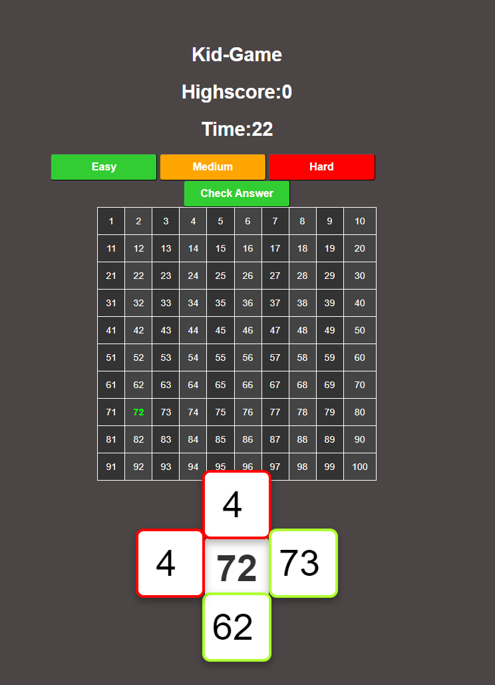

# 🎲 Number Guessing Game

- This project is a simple number guessing game built with HTML, CSS, and JavaScript. Users are challenged to guess numbers based on a randomly generated number displayed in a grid. The game includes input validation and visual feedback to enhance the user experience




# Kid-Game Documentation


## Table of Contents

1. [JavaScript Code Explanation 🖥️](#javascript-code-explanation)
   - [🌐 1.0 Global Variables](#10-global-variables)
   - [🔢 1.1 Generating a Random Number](#11-generating-a-random-number)
   - [🔄 1.2 Resetting Game Boxes and Feedback](#12-resetting-game-boxes-and-feedback)
   - [⏯️ 1.3 Enabling and Disabling the Check Answers Button](#13-enabling-and-disabling-the-check-answers-button) 
   - [✔️ 1.4 Checking if All Input Boxes are Filled](#14-checking-if-all-input-boxes-are-filled) 
   - [🏆 1.5 Highscore Management](#15-highscore-management)
   - [✅ 1.6 Finding Correct Answers](#16-finding-correct-answers)
   - [⏰ 1.7 Resetting Timer](#17-resetting-timer)
   - [🌍 1.8 Window onload Initialization](#18-windowonload)
   - [🎨 1.9 Color Buttons Based on Difficulty](#19-colorbuttons)
   - [👨‍💻 1.10 Checking User Answers](#110-checking-user-answers)
   - [🧮 1.11 Creating the Number Table](#111-creating-the-number-table)
   - [🚀 1.12 Initializing the Game](#112-initializing-the-game) 
   - [📞 1.13 Calling Methods in JS](#113-calling-methods-in-js)

2. [Step-by-Step Breakdown of the HTML Code 💻](#step-by-step-breakdown-of-the-html-code)
   - [🧑‍💻 2.0 Body](#20-body)
   - [🧠 2.1 Head Section](#21-head-section)
   - [🕹️ 2.2 Game Title](#22-game-title)
   - [⏱️🏅 2.3 Highscore and Timer Display](#23-highscore-and-timer-display)
   - [🔘 2.4 Difficulty Level Buttons](#24-difficulty-level-buttons)
   - [✅ 2.5 Check Answer Button](#25-check-answer-button)
   - [📊 2.6 Dynamic Table Container](#26-dynamic-table-container)
   - [🎲 2.7 Random Number Display](#27-random-number-display)
   - [✍️ 2.8 Answer Input Fields](#28-answer-input-fields)
   - [🕵️‍♂️ 2.9 Hidden Divs for Correct Answers](#29-hidden-divs-for-correct-answers)
   

3. [CSS Code Explanation](#css-code-explanation)
   - [🔄 3.0 Resetting Default Styles](#30-resetting-default-styles)
   - [💅 3.1 Body Styling](#31-body-styling)
   - [🖋️ 3.2 Heading Styling](#32-heading-styling)
   - [📐 3.3 Table Styling](#33-table-styling)
   - [🔲 3.4 Input Box and Button Styling](#34-input-box-and-button-styling)
   - [🧩 3.5 Custom Input Box Positioning and Styling](#35-custom-input-box-positioning-and-styling)
   - [❌✅ 3.6 Highlighting Correct and Wrong Answers](#36-highlighting-correct-and-wrong-answers)


4. [📊 Number summary](#-number-summary)  

5. [📚 More Resources & Tutorials](#-more-resources--tutorials)


  
    


<!--  on a time make a indsholdsforegnelse /índice   -->


# 🚀 Features
- 🎯 Generates a random number between 1 and 100.
- 🎲 Displays a 10x10 grid of numbers.
- ✍️ Users have four input fields to guess numbers based on simple arithmetic (addition and subtraction).
- ⚡ Provides immediate feedback on user inputs (correct or incorrect).
- 🔄 Allows users to generate a new random number and reset the game.

---

# 💻  Technologies Used
- HTML: Structure of the web page.
- CSS: Styling for the game elements.
- JavaScript: Game logic and interactivity.

---

# 📜 Code Explanation
- 🏗️ HTML Structure
    - The HTML file contains a div to hold the number grid, buttons for user interaction, and input fields for user guesses. The table for displaying numbers and the feedback elements for user inputs are created dynamically using JavaScript.

## JavaScript Code Explanation

- 🧠 JavaScript Logic

---

## 1.0 Global Variables
 -  let randomNumber;: Holds the random number generated for the game.
```javascript
  let randomNumber;
 ```
- Purpose: This variable will store the random number generated for the guessing game.

   

---

# 🎲 Functions
- 🎲 ```generateRandomNumber()```
## 1.1 Generating a Random Number
 ```javascript
function generateRandomNumber() {
    enableinputfileds();
    ColorButtons()
     // Reset inputs and game state
     Reset_GameBoxes_And_More();
     DisableBTN();
     correctCount = 0;
     checkPressed = false;

     randomNumber = Math.floor(Math.random() * 100) + 1;
     document.getElementById('randomNumber').textContent = randomNumber;
     createNumberTable(randomNumber);
 }
   ```
- Purpose: This function generates a new random number, displays it on the screen, creates a number grid, resets any previous game state, and ensures the "Check Answers" button is disabled until the user fills in their guesses.
  
    - 🎲 Generates a new random number between 1 and 100.
    - 🔄 Calls createNumberTable(randomNumber) to update the displayed grid.
    - 🧹 Calls Reset_GameBoxes_And_More() to clear previous inputs and feedback.
    - ⛔ Disables the "Check Answers" button until the user has filled out the input fields.

---

## 1.2 Resetting Game Boxes and Feedback
```javascript
function Reset_GameBoxes_And_More() {
    for (let i = 1; i <= 4; i++) {
        document.getElementById(`InputUser_TXT${i}`).value = ""; // Clears each input field
        document.getElementById(`TxtBox${i}_CorrectAnswer`).textContent = ""; // Clears displayed correct answers
        const parentBox = document.querySelectorAll('.input-box')[i - 1];
        parentBox.classList.remove('correct', 'wrong'); // Removes visual feedback classes
    }
} 
`
```
- Purpose: This function clears all input fields and feedback messages, ensuring a clean state for the next round of guesses.

  -  🧼 ```Reset_GameBoxes_And_More()```:
   -  🧼 Clears the values of the input fields and any displayed correct answers.
   -  🧹 Removes any visual feedback (correct or wrong) from previous guesses to ensure a fresh start.
---


---

##  1.3 Enabling and Disabling the Check Answers Button
 ```javascript 
function EnableBTN() {
    const button = document.getElementById('checkanswer');
    button.disabled = false; // Enables the button
    button.classList.remove('disable');
    button.classList.add('enable'); // Changes button appearance
}

function DisableBTN() {
    const button = document.getElementById('checkanswer');
    button.disabled = true; // Disables the button
    button.classList.add('disable');
    button.classList.remove('enable'); // Changes button appearance
}
```
- Purpose: These functions control the state of the "Check Answers" button, enabling or disabling it based on user input.

---

##  1.4 Checking if All Input Boxes are Filled
 ```javascript 
 function AllBoxesFilled() {
     const allFilled = [...Array(4).keys()].every(i => {
         const inputValue = document.getElementById(`InputUser_TXT${i + 1}`).value.trim();
         return inputValue !== "";  // Check if input is not empty
     });

     if (allFilled) {
         EnableBTN();  // Enable button when all input fields are filled
         
     } else {
         DisableBTN();  // Disable button if any input field is empty
     }
 }

 // Add event listeners for input fields to check if all are filled
 document.querySelectorAll('.input-box input').forEach(inputField => {
     inputField.addEventListener('input', AllBoxesFilled);  // Call AllBoxesFilled every time an input changes
 });
```

- Purpose: This function checks whether all input fields have been filled. If they are, it enables the button; if not, it keeps it disabled.

  -   ✅ Checks if all four input fields are filled.
  -   🎛️ Updates the state of the "Check Answers" button accordingly, enabling it only when all fields have values.


 ```javascript 
function EnableBTN() {
    const button = document.getElementById('checkanswer');
    button.disabled = false; // Enables the button
    button.classList.remove('disable');
    button.classList.add('enable'); // Changes button appearance
}

function DisableBTN() {
    const button = document.getElementById('checkanswer');
    button.disabled = true; // Disables the button
    button.classList.add('disable');
    button.classList.remove('enable'); // Changes button appearance
}
```
- Purpose: These functions control the state of the "Check Answers" button, enabling or disabling it based on user input.

- 🔓 ```EnableBTN() and DisableBTN()```:
   - 🔓 EnableBTN(): Enables the "Check Answers" button, allowing users to submit their guesses.
   - 🔒 DisableBTN(): Disables the button, preventing submission until all input fields are filled.
 
---
## 1.5 highscore-management
 ```javascript 
 function HIGHSCORE(){
    console.log("OLD HIGHSCORE " + Highscore);
   
    console.log("HAS ++++ HIGHWITH ONE NEW " +  Highscore)
    document.getElementById('highscore').textContent = Highscore
}
```
- Purpose:

  ---

## 1.6 Finding Correct Answers)
 ```javascript 
function FindCorrectAnswer() {
     let correctAnswers = [];
     if (currentLevel === 'easy') {
         correctAnswers = [
             randomNumber + 10,
             randomNumber + 1,
             randomNumber - 10,
             randomNumber - 1
         ];
     } else if (currentLevel === 'medium') {
         correctAnswers = [
             randomNumber + 20,
             randomNumber + 5,
             randomNumber - 20,
             randomNumber - 5
         ];
     } else if (currentLevel === 'hard') {
         correctAnswers = [
             randomNumber + 50,
             randomNumber + 10,
             randomNumber - 50,
             randomNumber - 10
         ];
     }

     return correctAnswers;
 }
 ```

- Purpose: The  ```FindCorrectAnswer ``` function generates an array of possible correct answers based on the current difficulty level ( ```easy ```,  ```medium ```,  ```hard ```), adjusting a base number ( ```randomNumber ```) with different values for each level.

---
## 1.7 Resetting Timer

 ```javascript 
' function resetTimer() {
     clearInterval(interval);
     interval = setInterval(function () {
         if (countdown <= 0) {
             clearInterval(interval);
             document.getElementById('Time').textContent = "0";
             disableinputfield();
             EnableBTN();
             
          //   alert("Game Over! Time's up!");
         
         } else {
             document.getElementById('Time').textContent = countdown;
             countdown--;

         }
     }, 1000);
 }


 ```

- Purpose: The  ```resetTimer ``` function resets and starts a countdown timer. It updates the displayed time every second and stops when the timer reaches zero, disabling input and enabling a button.

---

## 1.8 Window.onload

 ```javascript 

 window.onload = () => {
     setLevel('easy');  // Default level to 'easy'

 };
 ```
- Purpose: The  ```window.onload ``` function sets the default game difficulty to 'easy' when the page finishes loading.

---

## 1.9 ColorButtons
 ```javascript 
 function ColorButtons(){
    var button = document.getElementById("hardButton");
button.classList.add("Hard");

var button =  document.getElementById("mediumButton");
button.classList.add("Medium")

var button = document.getElementById("easyButton");
button.classList.add("Easy")
}
 ```
- Purpose: The  ```ColorButtons ``` function adds specific CSS classes ( ```Hard, ```  ```Medium, ```  ```Easy ```) to the buttons for different difficulty levels ( ```hardButton ```,  ```mediumButton ```,  ```easyButton ```), likely to style them according to their difficulty.

---

## 1.10 Checking User Answers
 ```javascript
 document.getElementById("checkanswer").addEventListener("click", function () {
     const correctAnswers = FindCorrectAnswer(); // Get the correct answers for the current level

     correctAnswers.forEach((answer, index) => {
         const input = document.getElementById(`InputUser_TXT${index + 1}`).value.trim();
         const parentBox = document.querySelectorAll('.input-box')[index];

         if (parseInt(input) === answer) {
             parentBox.classList.add('correct');
             parentBox.classList.remove('wrong');
             document.getElementById(`TxtBox${index + 1}_CorrectAnswer`).textContent = answer;
             correctCount++; // Increment the counter if the answer is correct
         } else {
             parentBox.classList.add('wrong');
             parentBox.classList.remove('correct');
         }
     });

     // Check if all answers are correct
     if (correctCount === 4) {
         Highscore++;
         document.getElementById('highscore').textContent = Highscore;
         checkPressed = true;
         document.getElementById("checkanswer").disabled = true;
         HIGHSCORE();
         clearInterval(interval);
     } else {
       
         checkPressed = false;
              
     }
 });
```
-  Purpose: This event listener checks user inputs against the correct answers when the button is clicked. It provides feedback on whether each guess was correct or wrong and updates the display accordingly.


- ✔️ ```checkAnswers()```:
  - ✔️ Compares the user's inputs against the correct answers derived from the random number.
  - 🎉 Provides visual feedback (green for correct, red for incorrect) by adding or removing classes based on the user's input.

---

## 1.11 Creating the Number Table
 ```javascript
function createNumberTable(randomNumber) {
    const tableContainer = document.getElementById('table-container');
    tableContainer.innerHTML = ''; // Clears the previous table
    const table = document.createElement('table'); // Creates a new table
    let counter = 1;

    for (let i = 0; i < 10; i++) { // Creates 10 rows
        const tr = document.createElement('tr');
        for (let j = 0; j < 10; j++) { // Creates 10 columns
            const td = document.createElement('td');
            td.textContent = counter; // Sets the cell's number
            if (counter === randomNumber) {
                td.classList.add('highlight'); // Highlights the cell with the random number
            }
            tr.appendChild(td);
            counter++;
        }
        table.appendChild(tr);
    }

    tableContainer.appendChild(table); // Appends the table to the container
}

```
- Purpose: This function creates a 10x10 grid of numbers and highlights the cell containing the random number. It updates the display every time a new number is generated.

---

## 1.12 Initializing the Game
 ```javascript
generateRandomNumber(); // Starts the game by generating a random number
setInterval(AllBoxesFilled, 0); // Continuously checks if all input boxes are filled
```
- Purpose: This code initializes the game when the page loads, generating the first random number and setting up an interval to monitor the input fields.

---

# 1.13 Calling Methods in js
 ```javascript
 generateRandomNumber();
setInterval(AllBoxesFilled, 0);
updatePlaceholders();  // Set initial placeholders on page load

 ```

- Purpose:  The code calls three functions to initialize and manage the game: generate a random number, check if all boxes are filled repeatedly, and set the initial placeholders on page load.

---

## Step-by-Step Breakdown of the HTML Code

## 0. HTML Document Setup

## 2.0 Body
-  ```<!DOCTYPE html> ```: Declares the document type as HTML5, ensuring modern HTML syntax and behavior.
-  ```<html lang="en"> ```: Defines the document language as English ( ```lang="en" ```), which helps with accessibility and search engine optimization.

 ```

 ```html 
<!DOCTYPE html>
<html lang="en">
 ```
## 2.1 Head Section
- The <head> section contains meta-information about the document, links to external resources, and sets up the document's character encoding and viewport.
  
    -  ``` <meta charset="UTF-8"> ```: Defines the character encoding as UTF-8 to support various characters and symbols.
    -  ```<meta name="viewport" content="width=device-width, initial-scale=1.0"> ```: Makes the page responsive on mobile devices by setting the viewport width to the device's width
    -  ```<link rel="stylesheet" href="../css/Style.css">: ``` Links the external stylesheet  ```(Style.css) ``` to style the page. This file is assumed to contain the game’s CSS rules
    -  ```<title>Kid-Game-TEST</title> ```: Sets the title of the web page, which appears in the browser tab

 ```html 
<head>
    <meta charset="UTF-8">
    <meta name="viewport" content="width=device-width, initial-scale=1.0">
    <link rel="stylesheet" href="../css/Style.css">
    <title>Kid-Game-TEST</title>
</head>
 ```
--- 

# 2.2 Game Title
-  ```<h1>Kid-Game</h1> ```: Displays the title of the game at the top of the page.

 ```html
<h1>Kid-Game</h1>
 ```

# 2.3 Highscore and Timer Display
- ```<h1> Highscore: <a id="highscore"> 0 </a> </h1>```: Displays the current highscore, initially set to 0.

- ```<h1> Time: <a id="Time"> 0 </a> </h1>```: Displays the remaining time for the game, also initially set to 0.

- These values will be dynamically updated using JavaScript to reflect the current game status.

 ```html
<h1> Highscore:   <a id="highscore">  0 </a>  </h1>
<h1> Time:   <a id="Time">  0 </a>  </h1>
 ```

 # 2.4 Difficulty Level Buttons
 - A set of three buttons allowing the user to select the difficulty level (Easy, Medium, or Hard).
 -  ```<button id="easyButton" onclick="setLevel('easy')">Easy</button> ```: When the Easy button is clicked, the  ```setLevel('easy') ``` function is called, setting the game's difficulty level to "easy"

- Similar buttons exist for Medium and Hard levels, each triggering the ```setLevel()``` function with their respective difficulty.

 ```html
<div class="LevelsButtons">
    <button id="easyButton" onclick="setLevel('easy')">Easy</button>
    <button id="mediumButton" onclick="setLevel('medium')">Medium</button>
    <button id="hardButton" onclick="setLevel('hard')">Hard</button>
</div>
 ```

# 2.5 Check Answer Button
- ```<button id="checkanswer">Check Answer</button>```: This button is used to check if the player's input matches the correct answers. The actual check would happen in the JavaScript logic when the user clicks this button.
 ```html
<div class="button-container">
    <button id="checkanswer">Check Answer</button>
</div>

 ```
# 2.6 Dynamic Table Container
- ```<div id="table-container"></div>```: This empty div will act as a container for any dynamic content or generated tables, likely used to display additional game-related data (like answers, scores, etc.).
 ```html
<div class="containerTABLE">
    <div id="table-container"></div> <!-- Container for generated table -->
</div>


 ```

# 2.7 Random Number Display
- ```<span id="randomNumber">0</span>```: Displays the random number generated for the game. This value will change based on the difficulty level and game logic, and will be displayed in a specific area on the page (inside a div with class ```number-box```)
 ```html
<div class="container">
    <div class="number-box">
        <span id="randomNumber">0</span> <!-- Display for random number -->
    </div>
</div>
 ```

# 2.8 Answer Input Fields
- There are four input fields where players can enter their answers based on the random number and difficulty level.
- Input fields are labeled with placeholders like ```+10```, ```+1```, ```-10```, and ```-1```. These correspond to the different possible adjustments the user needs to make to the random number.
- The fields are grouped within div elements with class names like ```top```, ```right```, ```bottom```, and ```left```, which will be used for styling.
 ```html
<div class="input-box top">
    <input type="number" id="InputUser_TXT1" placeholder="+10" maxlength="3" required>
</div>
<div class="input-box right">
    <input type="number" id="InputUser_TXT2" placeholder="+1" maxlength="3">
</div>
<div class="input-box bottom">
    <input type="number" id="InputUser_TXT3" placeholder="-10" maxlength="3">
</div>
<div class="input-box left">
    <input type="number" id="InputUser_TXT4" placeholder="-1" maxlength="3">
</div>
 ```

# 2.9 Hidden Divs for Correct Answers 
- These ```<div>``` elements are hidden by default (```style="display:none;```") and are used to store the correct answers for comparison purposes.
- These elements are likely manipulated by JavaScript to check if the player's input matches the correct answers.
 ```html
<div id="TxtBox1_CorrectAnswer" style="display:none;"></div>
<div id="TxtBox2_CorrectAnswer" style="display:none;"></div>
<div id="TxtBox3_CorrectAnswer" style="display:none;"></div>
<div id="TxtBox4_CorrectAnswer" style="display:none;"></div>
 ```

# 2.9 Linking External JavaScript Files
- The page links to two external JavaScript files that contain the core game logic:
- App.js: Handles the main game functions such as random number generation, timer, and checking answers.
- TableGenerate.js: Likely generates and updates tables or additional dynamic content in the game.

```html
  <script src="../js/App.js"></script>
<script src="TableGenerate.js"></script>

```
# 2.10 Generating a Random Number on Page Load
- The JavaScript function generateRandomNumber() is called as soon as the page loads to initialize the random number that will be displayed and used in the game.
```html
<script>generateRandomNumber();</script>
```
## CSS Code Explanation

## 3.0 Resetting Default Styles

```css

* {
    margin: 0;
    padding: 0;
    box-sizing: border-box;
}

```
- Purpose: Resets margin and padding for all elements to create a consistent look across browsers and sets the box model to include padding and border in the element's total width and height.

---

## 3.1 Body Styling

```css
body {
    display: flex;
    flex-direction: column;
    align-items: center;
    justify-content: center;
    min-height: 100vh;
    background-color: #4b4545; // Dark background
    color: white; // White text
    font-family: Arial, sans-serif; // Font family
}

```
- Purpose: Centers content vertically and horizontally, sets a dark background color, and applies a white font color for contrast.

---

## 3.2 Heading Styling
```css
h1 {
    margin-bottom: 20px;
    font-size: 36px;
    color: #fff;
    height: 50px;
    display: flex;
    justify-content: center;
    align-items: center;
}
```

- Purpose: Styles the main heading, adjusting the size and color for visibility.

---

## 3.3 Table Styling

```css
.table-container table  {
    width: 40%;
    border-collapse: collapse;
}

td {
    border: 2px solid #fff;
    padding: 15px;
    text-align: center;
    background-color: #333;
    color: #fff;
    font-size: 18px;
}

```

- Purpose: Styles the table and its cells, ensuring a cohesive look with borders, padding, and background colors.


--- 


## 3.4 Input Box and Button Styling
```css
.input-box {
    width: 130px; /* Match number box width */
    height: 130px; /* Match number box height */
    background-color: #ffffff; /* White background */
    border: 6px solid #222; /* Dark border */
    border-radius: 15px; /* Rounded corners */
    display: flex;
    justify-content: center;
    align-items: center;
    position: absolute;
    box-shadow: 0 8px 15px rgba(0, 0, 0, 0.3); /* Shadow for depth */
}

button {
     width: 200px;
    height: 50px;
    border-radius: 5px;
    cursor: pointer;
    font-size: 20px;
    font-weight: bold;
    background-color: #28a745; /* Green background */
    color: white;
    transition: background-color 0.3s, transform 0.3s; /* Smooth transitions */
}

```

- Purpose: Styles the input boxes and buttons, ensuring they are visually distinct and user-friendly.

---

## 3.5 Custom Input Box Positioning and Styling
- ```.enable```: Styles active elements with a limegreen background and white text.
```css
.enable {
    background-color: limegreen;
    color: white;
}
```
- ```.disable```: Styles active elements with a gray background and white text.
```css
.disable {
    background-color: gray;
    color: white;
    cursor: not-allowed;
}
```

  
  - ```.top```: Positions the element at the top center.
```css
.top {
    top: -60px;
    left: 50%;
    transform: translateX(-50%);
}
```
 - ```.right```: Positions the element at the right center.
```css
.right {
    top: 50%;
    right: -90px;
    transform: translateY(-50%);
}
```
-  ```.bottom```: Positions the element at the bottom center.
```css
.bottom {
    bottom: -70px;
    left: 50%;
    transform: translateX(-50%);
}
```
 - ```.left```: Positions the element at the left center
 ```css
.left {
    top: 50%;
    left: -90px;
    transform: translateY(-50%);
}
```

- These styles are ideal for positioning input boxes or other elements at distinct locations around a parent container, while keeping them centered at each edge.

---


## 3.6 Highlighting Correct and Wrong Answers
```css
.correct {
    border: 6px solid greenyellow; // Green border for correct answers
}

.wrong {
    border: 6px solid red; // Red border for wrong answers
}

.highlight {
    color: rgb(0, 248, 0);
    font-weight: bold;
}

```
-  Purpose: Visually indicates whether user inputs are correct or incorrect through colored borders.

---

## 📊 Number summary

## - 🎲  Random Number picked is: $${\color{lightgreen}{42}}$$

|  1 |  2 |  3 |  4 |  5 |  6 |  7 |  8 |  9 | 10 |
|---|---|---|---|---|---|---|---|---|---|
| 11 | 12 | 13 | 14 | 15 | 16 | 17 | 18 | 19 | 20 |
| 21 | 22 | 23 | 24 | 25 | 26 | 27 | 28 | 29 | 30 |
| 31 | 32 | 33| 34 | 35 | 36 | 37 | 38 | 39 | 40 |
| 41 | $${\color{lightgreen}{42}}$$  |43  | 44 | 45 | 46 | 47 | 48 | 49 | 50 |
| 51 | 52 | _53_ | 54 | 55 | 56 | 57 | 58 | 59 | 60 |
| 61 | 62 | 63 | 64 | 65 | 66 | 67 | 68 | 69 | 70 |
| 71 | 72 | 73 | 74 | 75 | 76 | 77 | 78 | 79 | 80 |
| 81 | 82 | 83 | 84 | 85 | 86 | 87 | 88 | 89 | 90 |
| 91 | 92 | 93 | 94 | 95 | 96 | 97 | 98 | 99 | 100 |
   

# 🛠️ Usage
-  To start the game, open the index.html file in a web browser.
  - 🔄  Click on "Generate New Number" to create a new random number and display it in the grid.
  - ✍️ Enter your guesses in the input fields.
  - ✔️ Click "Check Answers" to see which guesses are correct.
  - 🔄 The game can be reset by generating a new random number.

  ## 🎲 Random nummer var: $${\color{lightgreen}{42}}$$


- This tool helps users see and identify the numbers they need to work with and supports them in their mathematical learning. 🎉

---

## 📚 More Resources & Tutorials

Check out these amazing resources for more information and advanced coding skills: 📚

If you're looking to deepen your understanding, here are some helpful resources you might find useful:

- 🌟 [Official Visual Studio Documentation](https://docs.microsoft.com/en-us/visualstudio/)
- 📚 [My Coding Tutorials on YouTube](https://www.youtube.com/@CodeByScript)
- 🚀 [Explore My Projects Here!](https://github.com/PlutoGamerpro?tab=stars)  


